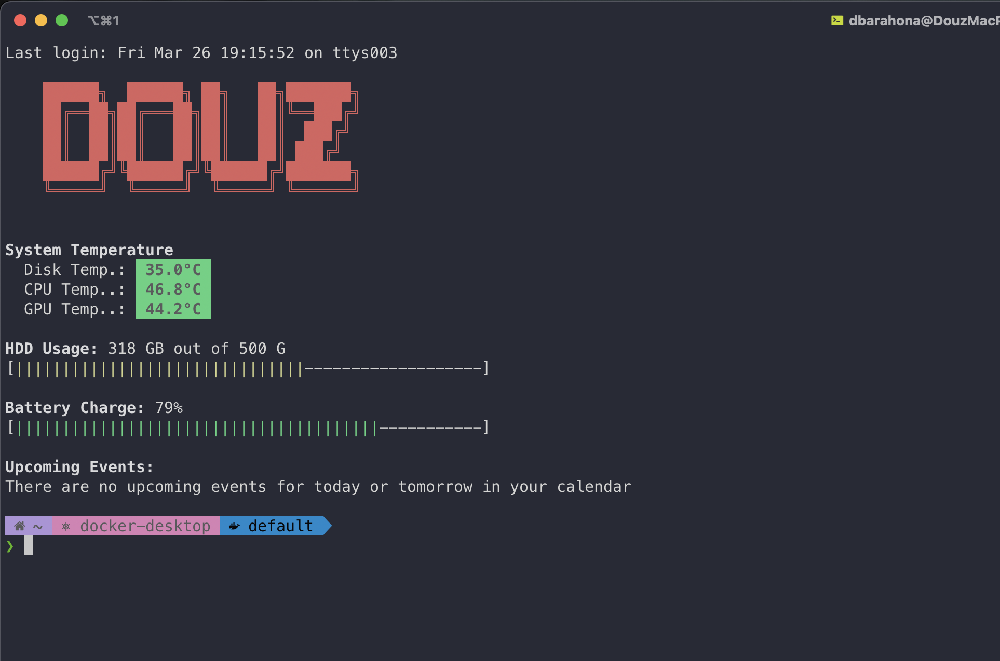

# mac-motd

Modular MOTD for macOS + zsh, with user config in `~/.douz.io/motd_config.zsh`.



## What This Repo Provides

- `motd.sh`: runtime module loader.
- `modules/*.sh`: output modules.
- `modules/README.md`: module catalog, dependencies, and authoring notes.
- `install.sh`: idempotent installer (shell hook + user config).
- `uninstall.sh`: clean uninstaller (`--purge-config` supported).
- `bin/mac-motd`: command wrapper (`run`, `install`, `uninstall`, `doctor`).
- `packaging/homebrew/mac-motd.rb`: formula template for your tap.

## Installation

### Option 1: Homebrew Tap (recommended)

Use your tap (hosted in GitHub, documented under `brew.douz.io`):

```bash
brew tap douz/tap
brew install mac-motd
mac-motd install
```

For upgrades after a new release:

```bash
brew update
brew upgrade mac-motd
mac-motd install
```

`brew upgrade` updates the packaged files, and `mac-motd install` refreshes the user runtime in `~/.local/share/douz-motd` without overwriting your existing `~/.douz.io/motd_config.zsh`.

### Option 2: Local/Source install

```bash
git clone git@github.com:douz/mac-motd.git
cd mac-motd
./install.sh
```

For upgrades after pulling a new release or updated branch:

```bash
git pull --ff-only
./install.sh
```

This refreshes the installed runtime in `~/.local/share/douz-motd` and preserves your existing `~/.douz.io/motd_config.zsh` unless you explicitly choose `./install.sh --refresh-config`.

## User Config Location

The installer creates:

```bash
~/.douz.io/motd_config.zsh
```

Default content is sourced from `config/motd_config.zsh`.

Running `mac-motd install` again preserves your existing config. If you intentionally want to replace it with the latest template, run:

```bash
mac-motd install --refresh-config
```

That command first creates a timestamped backup next to your config, for example `~/.douz.io/motd_config.zsh.bak.20260302091500`.

Example:

```zsh
modulesArray=(
  banner
  temperature
  hdd_usage
  battery
  calendar_events
)

bannerText="Douz"
```

## Commands

```bash
mac-motd run
mac-motd install
mac-motd install --refresh-config
mac-motd uninstall
mac-motd uninstall --purge-config
mac-motd doctor
```

## Uninstall

### Easy uninstall

```bash
mac-motd uninstall
```

This removes the shell hook and installed runtime files, but keeps your config.

### Full uninstall (including config)

```bash
mac-motd uninstall --purge-config
```

### If installed via Homebrew

```bash
brew uninstall mac-motd
```

Then optionally remove shell hook/config if still present:

```bash
mac-motd uninstall --purge-config
```

## Dependencies

The following tools are used by modules and should be installed when needed:

- `figlet`
- `ical-buddy`
- `osx-cpu-temp`
- `smartmontools`

Install with:

```bash
brew install figlet ical-buddy osx-cpu-temp smartmontools
```

The runtime skips modules whose dependencies are missing and prints a warning.

## Local Testing

Run the local test suite:

```bash
./tests/run.sh
```

What is covered:

- install idempotency (`install.sh` can run repeatedly without duplicate hooks)
- uninstall behavior (preserve vs purge config)
- runtime behavior for missing modules/dependencies

## Release Process

1. Update `CHANGELOG.md` under `[Unreleased]`.
2. Create and push a version tag:

```bash
git tag v0.1.3
git push origin v0.1.3
```

3. GitHub Actions will:
   - create a GitHub Release with generated notes (`.github/workflows/release.yml`)
   - update the Homebrew tap formula (`.github/workflows/publish-homebrew-tap.yml`)

## Project Ownership and Support

- Maintainer details: `MAINTAINERS.md`
- Community support expectations: `SUPPORT.md`
- Vulnerability reporting: `SECURITY.md`
- License: `LICENSE` (MIT)

## Module Development

Add new modules in `modules/<name>.sh`, then include them in `modulesArray` inside `~/.douz.io/motd_config.zsh`.

If a module requires commands, add its dependencies in `motd.sh` under `moduleRequirements`.

Keep [modules/README.md](modules/README.md) in sync whenever you add, remove, or change a module so contributors can see the current runtime behavior and dependencies in one place.

## Community and Governance

This repository includes:

- `LICENSE` (MIT)
- `CONTRIBUTING.md`
- `CODE_OF_CONDUCT.md`
- `SECURITY.md`
- GitHub issue templates and PR template under `.github/`

These files define contribution workflow, behavior standards, and private security reporting.
